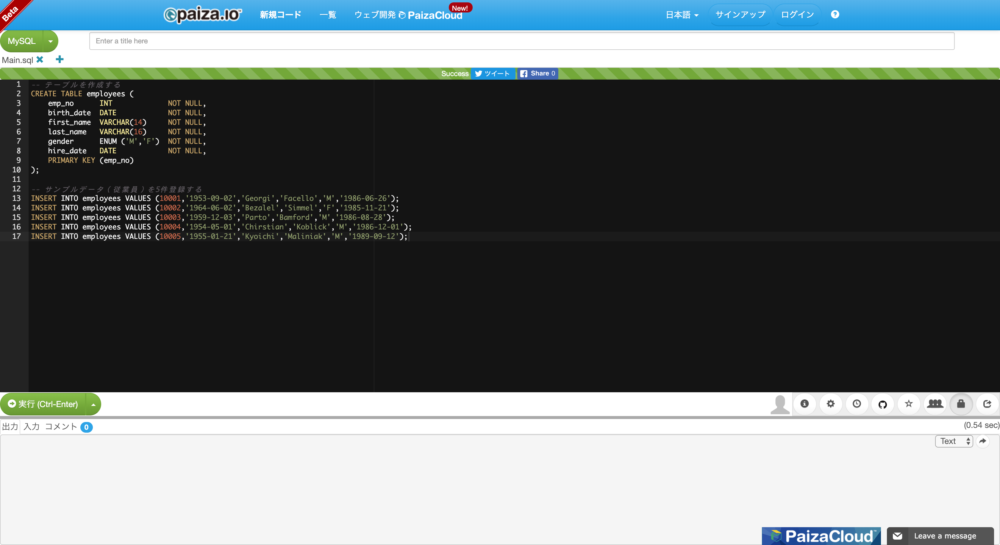
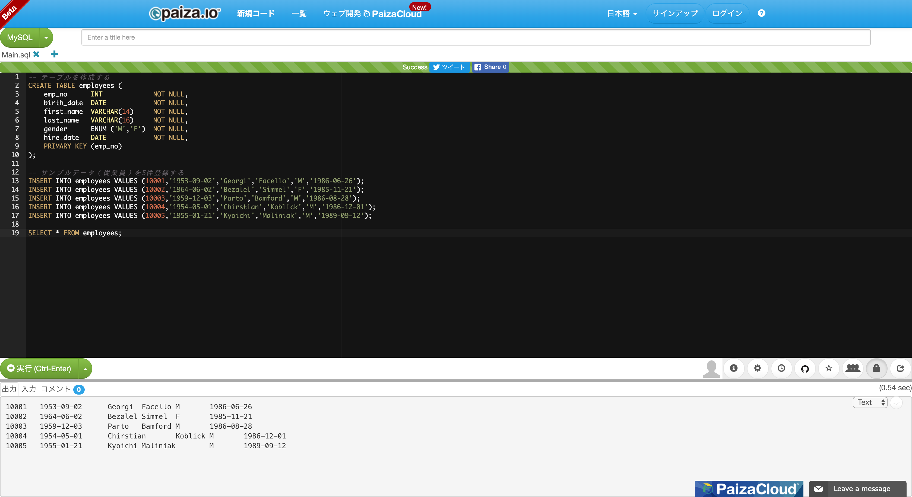
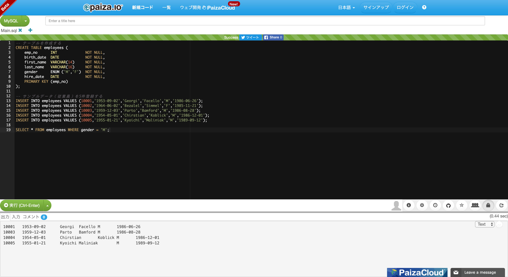
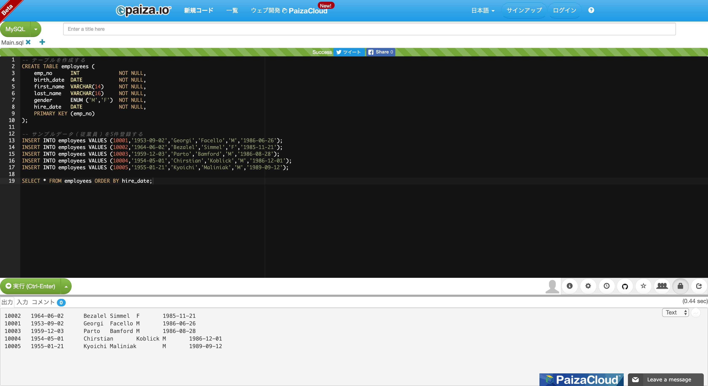
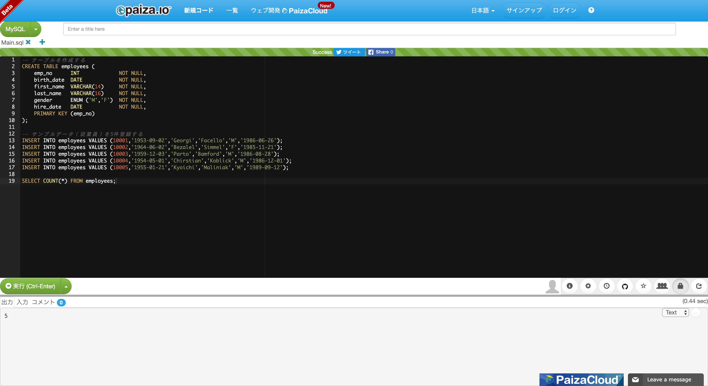
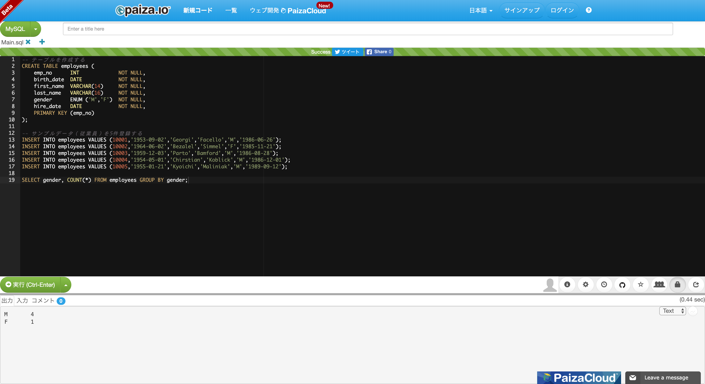

# 環境構築不要！paiza.IO を使ってカジュアルに SQL を練習する

## 1. paiza.IO にアクセスする

[paiza.IO](https://paiza.io/) にアクセスし **「新規コード」** をクリックします．次に左上にある言語選択プルダウンから **「MySQL」** を選択します．


## 2. サンプルデータを登録する

最初から入力されている SQL を全て消し，以下の SQL を貼り付けて **「実行」** をクリックします．出力欄には何も表示されず，上部に Success と表示されていれば正常に動いています．

なお，以下の SQL は MySQL から公式に提供されているサンプルデータから抜粋しています．

- https://dev.mysql.com/doc/index-other.html

```sql
-- テーブルを作成する
CREATE TABLE employees (
    emp_no      INT             NOT NULL,
    birth_date  DATE            NOT NULL,
    first_name  VARCHAR(14)     NOT NULL,
    last_name   VARCHAR(16)     NOT NULL,
    gender      ENUM ('M','F')  NOT NULL,
    hire_date   DATE            NOT NULL,
    PRIMARY KEY (emp_no)
);

-- サンプルデータ（従業員）を5件登録する
INSERT INTO employees VALUES (10001,'1953-09-02','Georgi','Facello','M','1986-06-26');
INSERT INTO employees VALUES (10002,'1964-06-02','Bezalel','Simmel','F','1985-11-21');
INSERT INTO employees VALUES (10003,'1959-12-03','Parto','Bamford','M','1986-08-28');
INSERT INTO employees VALUES (10004,'1954-05-01','Chirstian','Koblick','M','1986-12-01');
INSERT INTO employees VALUES (10005,'1955-01-21','Kyoichi','Maliniak','M','1989-09-12');
```



## 3. SQL を実行する

さっそく SQL を実行してみましょう．

以下の SQL を 2. で貼り付けた SQL の下に貼り付けて **「実行」** をクリックします．以下の SQL だけにしてしまうとエラーになってしまいます．また 3-2. 以降は `SELECT` から始まる SQL を書き換えましょう．


### 3-1. 全従業員を取得する

```sql
SELECT * FROM employees;
```



### 3-2. 従業員番号 = 10002 の従業員を取得する

```sql
SELECT * FROM employees WHERE emp_no = 10002;
```


### 3-3. 男性の従業員を取得する

```sql
SELECT * FROM employees WHERE gender = 'M';
```



### 3-4. 従業員を採用日順（昇順）にソートして取得する

```sql
SELECT * FROM employees ORDER BY hire_date;
```



### 3-5. 全従業員数を取得する

```sql
SELECT COUNT(*) FROM employees;
```



### 3-6. 従業員数を性別ごとに集計する

```sql
SELECT gender, COUNT(*) FROM employees GROUP BY gender;
```


